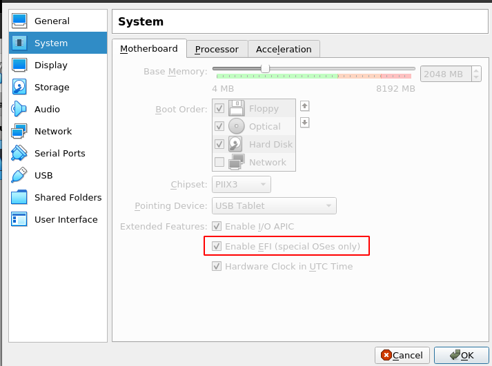
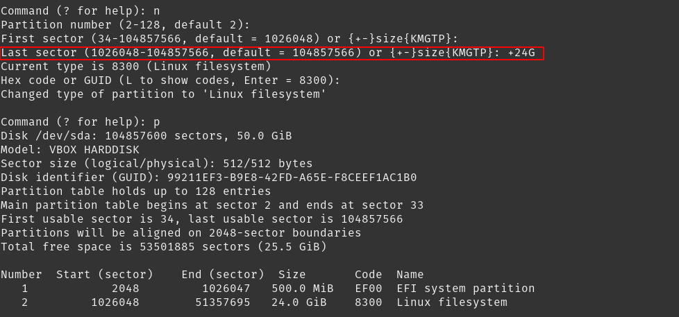
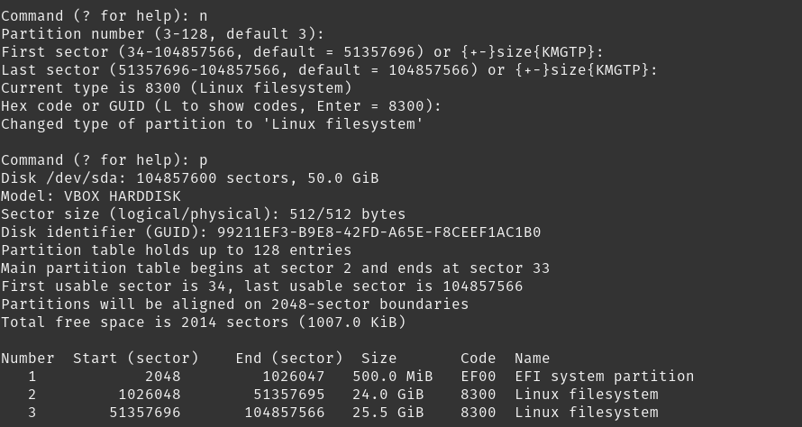
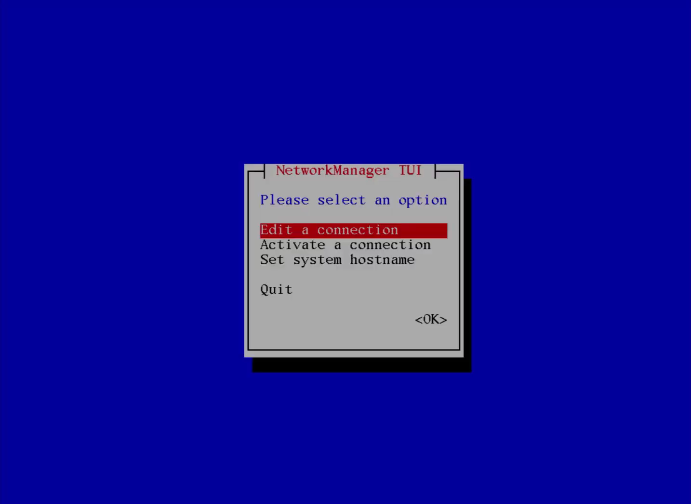

# Arch Linux Installation - EFI

This repo is just a form of study and comprehension of a more in deepth Arch Linux, and Linux in genral, system configure from the start. I use mostly a online tuturial from **Top Linux Tech**, almost transcribing his video (you should check that out in this [link](https://www.youtube.com/watch?v=QMBE5Kxb8Bg))

This is not intended to be a ripoff, just a form of me organising my ideias and, if may be, passing this knowloge forward!

I will use his video topics for organizing the blocks, and insert a few things here and there that I found different or just more suitable for my case (which may not be yours, so keep that in mind).

One of my goals is to be able to, at the end of this lessons, manage to format my desktop (I'm using Pop-Os) with an top of the notch Arch Linux, with all the funtionallyties that I have now (like gaming, for instance, with an NVIDEA GPU). 



### NOTE!

If you are installing Arch Linux in a virtual machine (using Virtualbox as a Hyper Visor, for instance), you'll need to enable the EFI in your setting BEFORE comencing the boot process.


## **1. Creating bootable USB flash drive**:

All devices are mounted in the /dev folder. In Linux, if we want to make a USB flash drive bootable, we can use the **dd** command:

```shell
[~]$ dd if=archlinux-2021.02.01-x86_64.iso of=/dev/usb bs=4M status=progress && sync
```

The **if** block is where you pass the .iso path, and the **to** block is where you pass the **flash driver device location**. The second command **sync** write any buffered data in memory to the disk, and in this case will boot the computer from the USB.


## **2. Starting the installation process**:

After the booting process, our system will boot from the **bootable USB driver**, letting us start the system in **Arch Linux Live Environment**.


After selecting the EFI option, we will see the live session intro screen.


Firstly, we can change the font if we want and the keyboard language. In my case, I use an **br-abnt2 keymap**. Using the localectl list-keymaps piped if grep, you can find which keymap suits you better:


To continue the installation, we need to have access to the internet. In my case, I will use ethernet cabled interface, and let the DHCP of my modem chose my IP. 

If that doesn't work autommatically, we can do a couple of tweaks:

```shell
root@archiso ~ # echo "nameserver 8.8.8.8" >> /etc/resolve.conf
```
In the case of DNS not resolving. Remeber to check the ethernet interfaces with **ip a show** command, and test with:

```shell
root@archiso ~ # ping 8.8.8.8 -c 3
PING 8.8.8.8 (8.8.8.8) 56(84) bytes of data.
64 bytes from 8.8.8.8: icmp_seq=1 ttl=117 time=9.64 ms
64 bytes from 8.8.8.8: icmp_seq=2 ttl=117 time=8.84 ms
64 bytes from 8.8.8.8: icmp_seq=3 ttl=117 time=41.7 ms

--- 8.8.8.8 ping statistics ---
3 packets transmitted, 3 received, 0% packet loss, time 2003ms
rtt min/avg/max/mdev = 8.844/20.068/41.717/15.311 ms
```

If that doesn't work either, you can try:
```shell
root@archiso ~ # systemclt stop systemd-resolve.service
root@archiso ~ # dhcpcd
```

If you are going to use WIFI connection and needs an wifi interface, you can type the **iwctl** command and follow these steps in the wizard:

```shell
root@archiso ~ # iwctl 
[iwd]# device list
```

This will show the wifi device (wlan0 for instance)

```shell
[iwd]# station wlan0 scan
```

```shell
[iwd]# station wlan0 get-networks
```

This will list the available wifi networks.

```shell
[iwd]# station wlan0 connect $YOUR_NETWORK_NAME
```

This command will ask for the wif password. Type it and you will connect to the wifi.

To exit the [iwd] menu and return to Arch Live Session:

```shell
[iwd]# exit
```

---

The next step is to update our mirror list that contains all the servers for the **pacman repositories**. This step is crucial to select only the ones closest to us. We can do this with 2 methods:


## Method 1:

So, lets use **Vim** to comment all the servers and than select only the ones we want:

```shell
root@archiso ~ # vim /etc/pacman.d/mirrorlist 
```

Press "Esc" to garantee you are in the **Normal Mode**, not in the **Insert Mode**. Type **":%s/Server/#Server/g"**.

That strage commands is actually very simple to undestand. 

1. **":"** switchs Vim to the **Command Mode** (for instance, if you want to save your file type ":w" and Enter; if you want to quit without saving type ":q!" and Enter; if you want to save and quit type ":wq" and Enter.) 

2. **"%s"** stands for substitution, and the following commands will match some patterns and replace them for other patterns, starting the pattern matching with the **"/"** key.

3. **/Server** is the pattern we want to be replaced.

4. **/#Server** is the pattern we want to be the final result.

Press Enter.

Now, just remove the **"#"**(uncomment) for the lines of servers you want to select. Sometimes the mirrorlist file we come if the location of the servers, but if it not, you can search online for them. 

## Method 2:

If you're like me, and are also lazy for this kind of manual labor (even if it uses Vim, which is an awesome and powerfull editor and we should have all the excuses to use it), there is a more automated tool for the job, an binary called **reflector**.

```shell
root@archiso ~ # sudo pacman -Syy reflector
```
Let's set ntp to true with the command:

```shell
root@archiso ~ # timedatectl set-ntp true
```

And than use reflector to update pacman's mirrorlist:

```shell
root@archiso ~ # reflector -c Brazil -a 6 --save /etc/pacman.d/mirrorlist
```

```vim
root@archiso ~ # reflector -c Brazil -a 6 --save /etc/pacman.d/mirrorlist
```

You can also pass the argument "--sort rate" to sort by speed.

After that, your /etc/pacman.d/mirrorlist should look something like:


---

After our mirrorlist is updated, we need to refresh our local package databse information, to synchronise it.

```shell
root@archiso ~ # pacman -Syy
:: Synchronizing package databases...
 core                  131.2 KiB  1704 KiB/s 00:00 [######################] 100%
 extra                1654.2 KiB  8.37 MiB/s 00:00 [######################] 100%
 community               5.4 MiB  13.0 MiB/s 00:00 [######################] 100%

```

Now, we begin the preparation of our **harddisk** or **ssd** for the operating system installation and configure the boot and home partitions.

A simple command that will help us keep track of our partitions is the lsblk command:

```shell
root@archiso ~ # lsblk
NAME  MAJ:MIN RM   SIZE RO TYPE MOUNTPOINT
loop0   7:0    0 571.4M  1 loop /run/archiso/sfs/airootfs
sda     8:0    0    50G  0 disk 
sr0    11:0    1 695.3M  0 rom  /run/archiso/bootmnt
```

From the man page, the **lsblk**:

*...lists information about all available or the specified block devices. The lsblk command reads the sysfs filesystem and udev db to gather information. If the udev db is not available or lsblk is compiled without udev support, then it tries to read LABELs, UUIDs and filesystem types from the block device. In this case root permissions are necessary. The command prints all block devices (except RAM disks) in a tree-like format by default.  Use lsblk --help to get a list of all available columns.*

In my case, my available drive is the *sda*, with 50G of free memory.

We will use the **gdisk** utility to manage our partitions (better for EFI type of installation than fdisk).

Now, pass the device location to the gdisk:

```shell
root@archiso ~ # gdisk /dev/sda 
```

In the first step, we will configure the **sda1 partition**, that will be our **boot partition**:


Type **n** for select new partition; we will accept the default number 1; than just Enter, to indicate that the First Sector will be the beggining of the disk; the Last Sector we specify with thew size of the partition, in my case 500M, typing +500M; The current propose partition type is **8300**, which is the Linux File System, but, since we are using EFI, we will use **EF00**.

If we type "p" we can print the current status of the sda device partitions:


Now, we will configure our **Operating System Partition**.



Type **n** for new partition; we will accept the default number 2; Enter to indicate that the First Sector of our O.S. partition will start where the Boot Partition ended; For the Last Sector, we wull define 24G typing +24G; For this partition, we can use the Linux File System GUID, 8300, since it's not a boot partition.

For the final partition, we will create the /home partition, using the remaining disk available.



For that, we will type **n** and than press Enter in all the options, to chose the default option given (note that pressing Enter in the Last Sector will automatically dispose all the remaining disk of the device, in my case **sda**)


Finally, we can flush the changes into our disk typing **w** in the command section, and **Y** to confirm.

Now, if we lsbk to list our block devices, we will have a different output:

```shell
root@archiso ~ # lsblk
NAME   MAJ:MIN RM   SIZE RO TYPE MOUNTPOINT
loop0    7:0    0 571.4M  1 loop /run/archiso/sfs/airootfs
sda      8:0    0    50G  0 disk 
├─sda1   8:1    0   500M  0 part 
├─sda2   8:2    0    24G  0 part 
└─sda3   8:3    0  25.5G  0 part 
sr0     11:0    1 695.3M  0 rom  /run/archiso/bootmnt
```

---

The next step for being able to use our three partitions is to format them with the appropriated file system.

For that task we will use **mkfs**.

In the Linux man page:

*mkfs is used to build a Linux filesystem on a device,  usually  a  hard disk  partition.   The device argument is either the device name (e.g., /dev/hda1, /dev/sdb2),  or  a  regular  file  that  shall  contain  the filesystem.   The  size argument is the number of blocks to be used for the filesystem.*

1. **Boot Partition**:

We will specify the flag **-t** for type, pass the **fat** file system, which is the standart for EFI partitions, **-F 32** and indicate our partition sda1.

```shell
root@archiso ~ # mkfs -t fat -F 32 /dev/sda1
mkfs.fat 4.1 (2017-01-24)
```

2. **O.S. Partition**:

We will specify the flag **-t** for type, pass the **ext4** file system, and indicate our partition sda2.

```shell
root@archiso ~ # mkfs -t ext4 /dev/sda2
mke2fs 1.45.7 (28-Jan-2021)
Creating filesystem with 6291456 4k blocks and 1572864 inodes
Filesystem UUID: 0a063db9-bd11-470d-9c71-6da1ac2edd72
Superblock backups stored on blocks: 
	32768, 98304, 163840, 229376, 294912, 819200, 884736, 1605632, 2654208, 
	4096000

Allocating group tables: done                            
Writing inode tables: done                            
Creating journal (32768 blocks): done
Writing superblocks and filesystem accounting information: done 
```

3. **Home Partition**:

We will repeat the same command as in the O.S. partition:

```shell
root@archiso ~ # mkfs -t ext4 /dev/sda3
mke2fs 1.45.7 (28-Jan-2021)
Creating filesystem with 6687483 4k blocks and 1672800 inodes
Filesystem UUID: 7f91ec8f-28ba-47e8-86ee-70b0626db022
Superblock backups stored on blocks: 
	32768, 98304, 163840, 229376, 294912, 819200, 884736, 1605632, 2654208, 
	4096000

Allocating group tables: done                            
Writing inode tables: done                            
Creating journal (32768 blocks): done
Writing superblocks and filesystem accounting information: done
```

Now we need to mount the formated partitions whitin the installation environment inside the /mnt folder, that will serve as a temporary mount directory that we will use during initiall operating system files extraction process and bootloader setup.

Since /mnt will serve as a temporary mount directory, we will use it to mount our root folder (in the installation ii will be "/"), so, we'll start with **sda2**.

```shell
root@archiso ~ # mount /dev/sda2 /mnt
```

We can run the lsblk command to check if the mountpoint was updated:

```shell
root@archiso ~ # lsblk
NAME   MAJ:MIN RM   SIZE RO TYPE MOUNTPOINT
loop0    7:0    0 571.4M  1 loop /run/archiso/sfs/airootfs
sda      8:0    0    50G  0 disk 
├─sda1   8:1    0   500M  0 part 
├─sda2   8:2    0    24G  0 part /mnt
└─sda3   8:3    0  25.5G  0 part 
sr0     11:0    1 695.3M  0 rom  /run/archiso/bootmnt
```

Now, we need to create a couple of folders in order to mount our **boot partition** and our **home partition**.

```shell
root@archiso ~ # mkdir -p /mnt/boot/efi
root@archiso ~ # mkdir /mnt/home
```

Note the in the first command I use -p flag. That allows me to create multiple folders at once (in this case /mnt/boot & /mnt/boot/efi).

Now we can mount **sda1** and **sda3**:

```shell
root@archiso ~ # mount /dev/sda1 /mnt/boot/efi
root@archiso ~ # mount /dev/sda3 /mnt/home 
root@archiso ~ # lsblk
NAME   MAJ:MIN RM   SIZE RO TYPE MOUNTPOINT
loop0    7:0    0 571.4M  1 loop /run/archiso/sfs/airootfs
sda      8:0    0    50G  0 disk 
├─sda1   8:1    0   500M  0 part /mnt/boot/efi
├─sda2   8:2    0    24G  0 part /mnt
└─sda3   8:3    0  25.5G  0 part /mnt/home
sr0     11:0    1 695.3M  0 rom  /run/archiso/bootmnt
```

For the next step, we will download and extract the O.S. files and the Kernel into the O.S. partition (sda2). 

We'll use the **pacstrap** command, a binary that install packages to the specified new root directory. As explained by the Linux man page:

*pacstrap is designed to create a new system installation from scratch. The specified packages will be installed into a given directory after setting up some basic mountpoints. By default, the host system’s pacman signing keys and mirrorlist will be used to seed the chroot.*

Arch comes with two Linux Kernel versions, the LTS and the latest version. For this I will choose the LTS (long term supported, stable older version), because life is to short to use the latest version (as my good ole friend André always says).

```shell
root@archiso ~ # pacstrap /mnt base linux-lts linux-firmware vim nano bash-completion linux-lts-headers base-devel 
```

\* Note: if you want to install the latest Kernel version replace **linux-lts** and **linux-lts-headers** for **linux** and **linux-headers**.

After waiting a few minutes, you successfully downloaded the O.S. files onto the O.S. partition. 

And now we will have to tell our system where to find its partitions on startup phase (by supplying the O.S. with the **fstab file**, which tells the system where to find its own partitions).

For that, we shall use the **genfstab** command, that generate output suitable for addition to an fstab file. By the Linux man page:

*genfstab helps fill in an fstab file by autodetecting all the current mounts below a given mountpoint and printing them in fstab-compatible format to standard output. It can be used to persist a manually mounted filesystem hierarchy and is often used during the initial install and configuration of an OS.*

```shell
root@archiso ~ # genfstab -U /mnt
# /dev/sda2
UUID=4dc09f24-7aff-42a9-b79f-15c84df97bda	/         	ext4      	rw,relatime	0 1

# /dev/sda1
UUID=E1AA-0EE5      	/boot/efi 	vfat      	rw,relatime,fmask=0022,dmask=0022,codepage=437,iocharset=ascii,shortname=mixed,utf8,errors=remount-ro	0 2

# /dev/sda3
UUID=feea96ea-ae74-4b6b-9264-e2d335317a3c	/home     	ext4      	rw,relatime	0 2
```

\* the -U flag is used for **unique identifiers**

This will not work, because we need to write fstab file inside the O.S. partition.

```shell
root@archiso ~ # genfstab -U /mnt >> /mnt/etc/fstab
root@archiso ~ # cat /mnt/etc/fstab
# Static information about the filesystems.
# See fstab(5) for details.

# <file system> <dir> <type> <options> <dump> <pass>
# /dev/sda2
UUID=4dc09f24-7aff-42a9-b79f-15c84df97bda	/         	ext4      	rw,relatime	0 1

# /dev/sda1
UUID=E1AA-0EE5      	/boot/efi 	vfat      	rw,relatime,fmask=0022,dmask=0022,codepage=437,iocharset=ascii,shortname=mixed,utf8,errors=remount-ro	0 2

# /dev/sda3
UUID=feea96ea-ae74-4b6b-9264-e2d335317a3c	/home     	ext4      	rw,relatime	0 2
```

Much better!

---

Now its time to switch to inside our actual Arch installation and resume the process from there, using **arch-chroot** command. From the Linux man page:

*arch-chroot wraps the chroot(1) command while ensuring that important functionality is available, e.g. mounting /dev/, /proc and other API filesystems, or exposing resolv.conf(5) to the chroot. If command is unspecified, arch-chroot will launch /bin/bash.*

```shell
root@archiso ~ # arch-chroot /mnt
[root@archiso /]# 
```

The next step is to install the bootloader (**grub**) and a couple of other very important packages. Here we will need to be wary of the architecture of our CPU, because we need to install the microcode that will be used by grub in the boot phase. If you use AMD, you'll need to download **amd-ucode**. Since my CPU is a intel x86_64, I'll use the intel-ucode.

```shell
[root@archiso /]# pacman -S grub efibootmgr efivar networkmanager intel-ucode
```

After downloading we need to install the grub bootloader to the disk:

```shell
[root@archiso /]# grub-install /dev/sda
Installing for x86_64-efi platform.
Installation finished. No error reported.
```
\* in these phase, if you are using Virtualbox and did not enabled the EFI option the bootloader installation will fail.

In here, we can edit the grub file to match you needs. Use Vim to access the file in /etc/default/grub (this is completely optional).

You can change, for instance, the resolution from **auto** to your native monitor resolution. If you don't know what your native monitor resolution is, type:

```shell
[$] xdpyinfo| grep dimensions
  dimensions:    1920x1080 pixels (483x272 millimeters)
```

Save your changes with "Esc + :wq".

Now we can write the **grub.cfg** file.

```shell
[root@archiso /]# grub-mkconfig -o /boot/grub/grub.cfg
Generating grub configuration file ...
Found linux image: /boot/vmlinuz-linux-lts
Found initrd image: /boot/intel-ucode.img /boot/initramfs-linux-lts.img
Found fallback initrd image(s) in /boot: initramfs-linux-lts-fallback.img
done
```

Note that the intel microcode package has been included!

Next step is to enable network manager service to allows us to have network connectivity when we boot into our operating system for the first time.

```shell
[root@archiso /]# systemctl enable NetworkManager
Created symlink /etc/systemd/system/multi-user.target.wants/NetworkManager.service → /usr/lib/systemd/system/NetworkManager.service.
Created symlink /etc/systemd/system/dbus-org.freedesktop.nm-dispatcher.service → /usr/lib/systemd/system/NetworkManager-dispatcher.service.
Created symlink /etc/systemd/system/network-online.target.wants/NetworkManager-wait-online.service → /usr/lib/systemd/system/NetworkManager-wait-online.service.
```

Now, set the root's password:

```shell
[root@archiso /]# passwd
New password:
Retype new password:
passwd: password updated successfully
```

---

## **3. Finishing installation & first boot**:


Now we can finally exit the chroot environment and go back to the live session.

```shel
[root@archiso /]# exit
exit
root@archiso ~ # 
```

Here we need to **unmount** all partitions we used during the installation phase.

First we will unmount the **boot partition**, secondly our **home partition** and finally (in that order) the **operating system partitio**:

```shell
root@archiso ~ # umount /mnt/boot/efi
root@archiso ~ # umount /mnt/home 
root@archiso ~ # umount /mnt
root@archiso ~ # lsblk
NAME   MAJ:MIN RM   SIZE RO TYPE MOUNTPOINT
loop0    7:0    0 571.4M  1 loop /run/archiso/sfs/airootfs
sda      8:0    0    50G  0 disk 
├─sda1   8:1    0   500M  0 part 
├─sda2   8:2    0    24G  0 part 
└─sda3   8:3    0  25.5G  0 part 
sr0     11:0    1 695.3M  0 rom  /run/archiso/bootmnt
```

Reboot your system and wait to be greeted by grub.

---

Now, we need to install all the necessary softwares, drivers and the Graphical User Environment.

Firtly, you will need to check for internet connection, because we are in a newly installed operating system.

Using the **networkctl list**, you will be able to see all the network interfaces, including you wifi interface. It will be something like this:


Type **nmtui** to access the network manager text user interface:

```shell
[root@archlinux ~]# nmtui
```
For the rest of the configuration fallow the steps bellow:




Choose a any name for you profile, but remember the wifi device name you just checked with networkctl list.


Leave the text user interface, and type nmcli connection show, to check if your wifi network is active, and ping google.com to finish the configuration.

---

## **4. Setting up hostname, time, locale & swap file**:

Simply edit the file with:

```shell
[root@archlinux ~]# vim /etc/hostname
```
```vim
archvirtualbox
~
~
~
```

Now, we'll edit the hosts file:

```shell
[root@archlinux ~]# vim /etc/hosts
```

```vim
# Static table lookup for hostnames.
# See hosts(5) for details.
127.0.0.1       localhost
::1             localhost
127.0.0.1       archvirtualbox.localdomain  archvirtualbox
```
Save and exit with "Esc + :wq".

Next step is to 


```shell
[root@archlinux ~]# timedatectl set-ntp
```


## **5. Setting up custom environment variables (.bashrc basic settings)**:


## **6. Creating a standard user account**:


## **7. Installing Xorg, fonts, drivers & desktop environment**:


## **8. Customizing the Gnome desktop (gnome tweaks & shell extensions)**:


## **9. Installing software / AUR (pacman, aur helpers & unofficial repositories)**:


## **10. Managing disk mounts & setting basic permissions (fstab & udisks policy)**:


## **11. Performing basic system maintenance tasks (cleanup, logs, ssd trim, etc...)**:


## References:

- https://www.youtube.com/watch?v=QMBE5Kxb8Bg (most of the process and tutorial);
- https://www.youtube.com/watch?v=_3-OMUQTf_k&t=392s