# Arch Linux Installation - EFI

This repository is a form of study and comprehension of a deeper Arch Linux, and Linux in general, system configure from the start. I use as basis an online tuturial from **Top Linux Tech**, and most of the information here comes from his video (you should check it out in this [link](https://www.youtube.com/watch?v=QMBE5Kxb8Bg))

This is not intended to be a ripoff, just a form of me organising ideias and, if possible, passing this knowloge forward!

I will use his video topics to organize the blocks, and insert a few things here and there that I found different or just more suitable for my case (which may not be yours, so keep that in mind).

One of my goals is to be able to, at the end of this lesson, format my desktop (I'm using Pop-Os!) with a top-notch Arch Linux, with all the funtionalities that I have now (like gaming, for instance, with an NVIDEA GPU). 

Last but not least, don't forget to visit the Official Wiki from ArchLinux https://wiki.archlinux.org/index.php/installation_guide.


### NOTE!

If you are installing Arch Linux in a virtual machine (using Virtualbox as a Hyper Visor, for instance), you'll need to enable the EFI in your settings BEFORE commencing the boot process.


## **1. Creating bootable USB flash drive**:

In Linux, all devices are mounted in the /dev folder. If we want to make a USB flash drive bootable, we can use the **dd** command:

```shell
[~]$ dd if=archlinux-2021.02.01-x86_64.iso of=/dev/usb bs=4M status=progress && sync
```

The **if** (input file) block is where you define the .iso path, and the **of** (output file) block is where you define the **flash driver device location**. The second command **sync** writes any buffered data in memory to the disk, and in this case will boot the computer from the USB.


Alternatively, we can use a software called **Etcher** to make our flashdrive bootable (https://www.balena.io/etcher).


Select the path of the *iso* file, then the path for the USB flashdrive, and finally click the **Flash!** button.

After that, you should reboot your PC and enter BIOS setup (In my case I have to keep clicking *F2* or *Del*). Make sure your motherboard is compatibble with UEFI (it probably is). Change the order of boot in your BIOS GUI to make sure the Archlinux bootable USB flashdrive will be the first to boot up.

Save the changes and leave BIOS.

## **2. Starting the installation process**:

After the booting process, our system will boot from the **bootable USB driver**, letting us start the system in **Arch Linux Live Environment**.

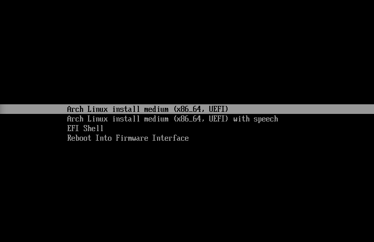

After selecting the EFI option, we will see the live session intro screen.

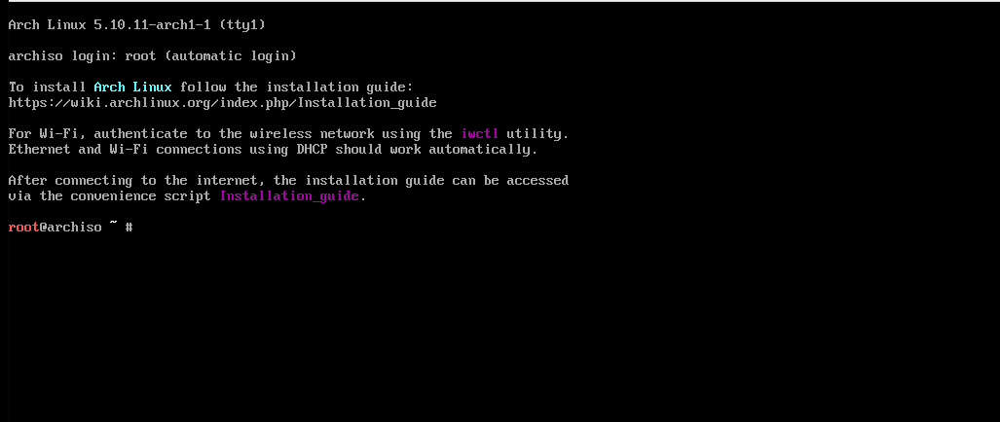

Firstly, we can change the font and the keyboard language if we want to. In my case, I use an **br-abnt2 keymap**. Using the localectl list-keymaps piped with grep, you can find which keymap suits you better:


To continue the installation, we need to have access to the internet. In my case, I will use my ethernet cabled interface, and let the DHCP of my modem chose my IP. 

If that doesn't work autommatically, we can do a couple of tweaks:

```shell
root@archiso ~ # echo "nameserver 8.8.8.8" >> /etc/resolve.conf
```
In the case of DNS not resolving, remeber to check the ethernet interfaces with **ip a show** command, and test with:

```shell
root@archiso ~ # ping 8.8.8.8 -c 3
PING 8.8.8.8 (8.8.8.8) 56(84) bytes of data.
64 bytes from 8.8.8.8: icmp_seq=1 ttl=117 time=9.64 ms
64 bytes from 8.8.8.8: icmp_seq=2 ttl=117 time=8.84 ms
64 bytes from 8.8.8.8: icmp_seq=3 ttl=117 time=41.7 ms

--- 8.8.8.8 ping statistics ---
3 packets transmitted, 3 received, 0% packet loss, time 2003ms
rtt min/avg/max/mdev = 8.844/20.068/41.717/15.311 ms
```

If that doesn't work either, you can try:
```shell
root@archiso ~ # systemclt stop systemd-resolve.service
root@archiso ~ # dhcpcd
```

If you are going to use WIFI connection and needs an wifi interface, you can type the **iwctl** command and follow these steps in the wizard:

```shell
root@archiso ~ # iwctl 
[iwd]# device list
```

This will show the Wifi device (wlan0 for instance)

```shell
[iwd]# station wlan0 scan
```

```shell
[iwd]# station wlan0 get-networks
```

This will list the available Wifi networks.

```shell
[iwd]# station wlan0 connect $YOUR_NETWORK_NAME
```

This command will ask for the Wifi password. Type it and you will connect to the Wifi.

To exit the [iwd] menu and return to Arch Live Session:

```shell
[iwd]# exit
```

---

The next step is to update our mirror list that contains all the servers for the **pacman repositories**. In this step it is crucial to select only the ones closest to us. We can do this using 2 methods:


## Method 1:

So, lets use **Vim** to comment all the servers and then select only the ones we want:

```shell
root@archiso ~ # vim /etc/pacman.d/mirrorlist 
```

Press "Esc" to guarantee you are in the **Normal Mode**, not in the **Insert Mode**. Type **":%s/Server/#Server/g"**.

That strange command is actually very simple to undestand. 

1. **":"** switchs Vim to the **Command Mode** (for instance, if you want to save your file type ":w" and Enter; if you want to quit without saving type ":q!" and Enter; if you want to save and quit type ":wq" and Enter.) 

2. **"%s"** stands for substitution, and the following commands will match some patterns and replace them for other patterns, starting the pattern matching with the **"/"** key.

3. **/Server** is the pattern we want to replace.

4. **/#Server** is the pattern we want to be the final result.

Press Enter.

Now, just remove the **"#"**(uncomment) for the lines of servers you want to select. Sometimes the mirrorlist file will come with the location of the servers, but if it not, you can search online for them. 

## Method 2:

If you're like me, and are also lazy for this kind of manual labor (even if it uses Vim, which is an awesome and powerful editor and we should use it in every opportunity), there is a more automated tool for the job, a binary called **reflector**.

```shell
root@archiso ~ # sudo pacman -Syy reflector
```
Let's set ntp to true with the command:

```shell
root@archiso ~ # timedatectl set-ntp true
```

And then use reflector to update pacman's mirrorlist:

```shell
root@archiso ~ # reflector -c Brazil -a 6 --save /etc/pacman.d/mirrorlist
```

```vim
root@archiso ~ # reflector -c Brazil -a 6 --save /etc/pacman.d/mirrorlist
```

You can also pass the argument "--sort rate" to sort by speed.

After that, your /etc/pacman.d/mirrorlist should look something like:

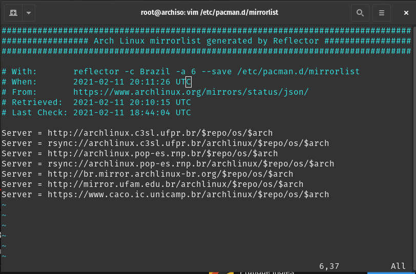

---

After our mirrorlist is updated, we need to refresh our local package database information, to synchronize it.

```shell
root@archiso ~ # pacman -Syy
:: Synchronizing package databases...
 core                  131.2 KiB  1704 KiB/s 00:00 [######################] 100%
 extra                1654.2 KiB  8.37 MiB/s 00:00 [######################] 100%
 community               5.4 MiB  13.0 MiB/s 00:00 [######################] 100%

```

Now, we begin the preparation of our **harddisk** or **ssd** for the operating system installation and configure the boot and home partitions.

A simple command that will help us keep track of our partitions is the lsblk command:

```shell
root@archiso ~ # lsblk
NAME  MAJ:MIN RM   SIZE RO TYPE MOUNTPOINT
loop0   7:0    0 571.4M  1 loop /run/archiso/sfs/airootfs
sda     8:0    0    50G  0 disk 
sr0    11:0    1 695.3M  0 rom  /run/archiso/bootmnt
```

From the manual page, the **lsblk**:

*...lists information about all available or the specified block devices. The lsblk command reads the sysfs filesystem and udev db to gather information. If the udev db is not available or lsblk is compiled without udev support, then it tries to read LABELs, UUIDs and filesystem types from the block device. In this case root permissions are necessary. The command prints all block devices (except RAM disks) in a tree-like format by default.  Use lsblk --help to get a list of all available columns.*

In my case, my available drive is the *sda*, with 50G of free memory.

We will use the **gdisk** utility to manage our partitions (better for EFI type of installation than fdisk).

Now, pass the device location to the gdisk:

```shell
root@archiso ~ # gdisk /dev/sda 
```

In the first step, we will configure the **sda1 partition**, that will be our **boot partition**:

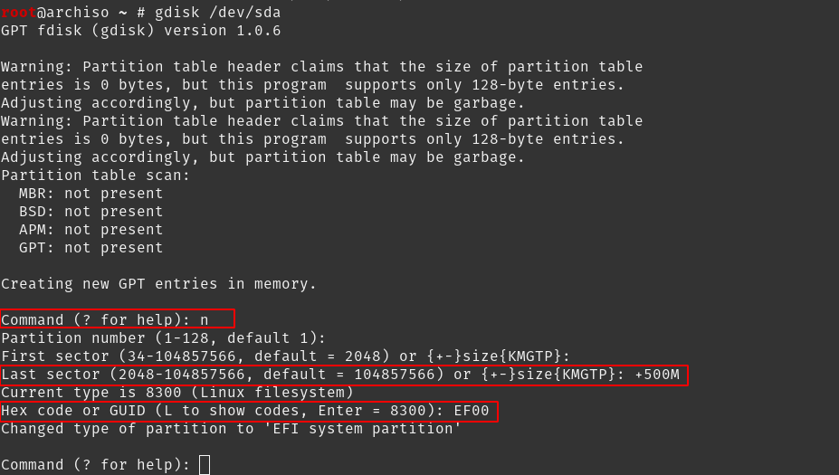

Type **n** to select new partition; we will accept the default number 1; then just Enter, to indicate that the First Sector will be the beggining of the disk; the Last Sector we specify with the size of the partition, in my case 500M, typing +500M; The current proposed partition type is **8300**, which is the Linux File System, but, since we are using EFI, we will use **EF00**.

If we type "p" we can print the current status of the sda device partitions:

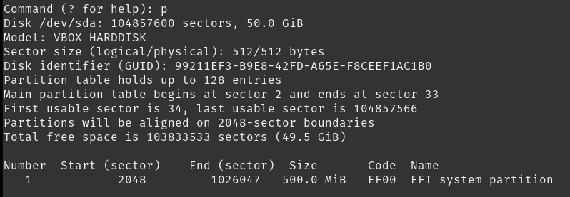

Now, we will configure our **Operating System Partition**.


Type **n** for new partition; we will accept the default number 2; Enter to indicate that the First Sector of our O.S. partition will start where the Boot Partition ended; For the Last Sector, we will define 24G typing +24G; For this partition, we can use the Linux File System GUID, 8300, since it's not a boot partition.

For the final partition, we will create the /home partition, using the remaining disk available.


For that, we will type **n** and then press Enter in all the options, to chose the default option given (note that pressing Enter in the Last Sector will automatically dispose all the remaining disk of the device, in my case **sda**)


Finally, we can flush the changes into our disk by typing **w** in the command section, and **Y** to confirm.

Now, if we lsbk to list our block devices, we will have a different output:

```shell
root@archiso ~ # lsblk
NAME   MAJ:MIN RM   SIZE RO TYPE MOUNTPOINT
loop0    7:0    0 571.4M  1 loop /run/archiso/sfs/airootfs
sda      8:0    0    50G  0 disk 
├─sda1   8:1    0   500M  0 part 
├─sda2   8:2    0    24G  0 part 
└─sda3   8:3    0  25.5G  0 part 
sr0     11:0    1 695.3M  0 rom  /run/archiso/bootmnt
```

---

The next step for being able to use our three partitions is to format them with the appropriated file system.

For that task we will use **mkfs**.

In the Linux manual page:

*mkfs is used to build a Linux filesystem on a device,  usually  a  hard disk  partition.   The device argument is either the device name (e.g., /dev/hda1, /dev/sdb2),  or  a  regular  file  that  shall  contain  the filesystem.   The  size argument is the number of blocks to be used for the filesystem.*

1. **Boot Partition**:

We will specify the flag **-t** for type, pass the **fat** file system, which is the standard for EFI partitions, **-F 32** and indicate our partition sda1.

```shell
root@archiso ~ # mkfs -t fat -F 32 /dev/sda1
mkfs.fat 4.1 (2017-01-24)
```

2. **O.S. Partition**:

We will specify the flag **-t** for type, pass the **ext4** file system, and indicate our partition sda2.

```shell
root@archiso ~ # mkfs -t ext4 /dev/sda2
mke2fs 1.45.7 (28-Jan-2021)
Creating filesystem with 6291456 4k blocks and 1572864 inodes
Filesystem UUID: 0a063db9-bd11-470d-9c71-6da1ac2edd72
Superblock backups stored on blocks: 
	32768, 98304, 163840, 229376, 294912, 819200, 884736, 1605632, 2654208, 
	4096000

Allocating group tables: done                            
Writing inode tables: done                            
Creating journal (32768 blocks): done
Writing superblocks and filesystem accounting information: done 
```

3. **Home Partition**:

We will repeat the same command as in the O.S. partition:

```shell
root@archiso ~ # mkfs -t ext4 /dev/sda3
mke2fs 1.45.7 (28-Jan-2021)
Creating filesystem with 6687483 4k blocks and 1672800 inodes
Filesystem UUID: 7f91ec8f-28ba-47e8-86ee-70b0626db022
Superblock backups stored on blocks: 
	32768, 98304, 163840, 229376, 294912, 819200, 884736, 1605632, 2654208, 
	4096000

Allocating group tables: done                            
Writing inode tables: done                            
Creating journal (32768 blocks): done
Writing superblocks and filesystem accounting information: done
```

Now we need to mount the formatted partitions within the installation environment inside the /mnt folder, that will serve as a temporary mount directory that we will use during initial operating system files extraction process and bootloader setup.

Since /mnt will serve as a temporary mount directory, we will use it to mount our root folder (in the installation ii will be "/"), so, we'll start with **sda2**.

```shell
root@archiso ~ # mount /dev/sda2 /mnt
```

We can run the lsblk command to check if the mountpoint was updated:

```shell
root@archiso ~ # lsblk
NAME   MAJ:MIN RM   SIZE RO TYPE MOUNTPOINT
loop0    7:0    0 571.4M  1 loop /run/archiso/sfs/airootfs
sda      8:0    0    50G  0 disk 
├─sda1   8:1    0   500M  0 part 
├─sda2   8:2    0    24G  0 part /mnt
└─sda3   8:3    0  25.5G  0 part 
sr0     11:0    1 695.3M  0 rom  /run/archiso/bootmnt
```

Now, we need to create a couple of folders in order to mount our **boot partition** and our **home partition**.

```shell
root@archiso ~ # mkdir -p /mnt/boot/efi
root@archiso ~ # mkdir /mnt/home
```

Note the in the first command I use -p flag. That allows me to create multiple folders at once (in this case /mnt/boot & /mnt/boot/efi).

Now we can mount **sda1** and **sda3**:

```shell
root@archiso ~ # mount /dev/sda1 /mnt/boot/efi
root@archiso ~ # mount /dev/sda3 /mnt/home 
root@archiso ~ # lsblk
NAME   MAJ:MIN RM   SIZE RO TYPE MOUNTPOINT
loop0    7:0    0 571.4M  1 loop /run/archiso/sfs/airootfs
sda      8:0    0    50G  0 disk 
├─sda1   8:1    0   500M  0 part /mnt/boot/efi
├─sda2   8:2    0    24G  0 part /mnt
└─sda3   8:3    0  25.5G  0 part /mnt/home
sr0     11:0    1 695.3M  0 rom  /run/archiso/bootmnt
```

For the next step, we will download and extract the O.S. files and the Kernel into the O.S. partition (sda2). 

We'll use the **pacstrap** command, a binary that installs packages to the specified new root directory. As explained on the Linux manual page:

*pacstrap is designed to create a new system installation from scratch. The specified packages will be installed into a given directory after setting up some basic mountpoints. By default, the host system’s pacman signing keys and mirrorlist will be used to seed the chroot.*

Arch comes with two Linux Kernel versions, the LTS and the latest version. For this I will choose the LTS (long term supported, stable older version), because life is too short to use the latest version (as my good old friend André always says).

```shell
root@archiso ~ # pacstrap /mnt base linux-lts linux-firmware vim nano git bash-completion linux-lts-headers base-devel 
```

\* Note: if you want to install the latest Kernel version replace **linux-lts** and **linux-lts-headers** for **linux** and **linux-headers**.

After waiting a few minutes, you successfully downloaded the O.S. files onto the O.S. partition. 

And now we will have to tell our system where to find its partitions on startup phase (by supplying the O.S. with the **fstab file**, which tells the system where to find its own partitions).

For that, we shall use the **genfstab** command, that generates output suitable for addition to an fstab file. By the Linux manual page:

*genfstab helps fill in an fstab file by autodetecting all the current mounts below a given mountpoint and printing them in fstab-compatible format to standard output. It can be used to persist a manually mounted filesystem hierarchy and is often used during the initial install and configuration of an OS.*

```shell
root@archiso ~ # genfstab -U /mnt
# /dev/sda2
UUID=4dc09f24-7aff-42a9-b79f-15c84df97bda	/         	ext4      	rw,relatime	0 1

# /dev/sda1
UUID=E1AA-0EE5      	/boot/efi 	vfat      	rw,relatime,fmask=0022,dmask=0022,codepage=437,iocharset=ascii,shortname=mixed,utf8,errors=remount-ro	0 2

# /dev/sda3
UUID=feea96ea-ae74-4b6b-9264-e2d335317a3c	/home     	ext4      	rw,relatime	0 2
```

\* the -U flag is used for **unique identifiers**

This will not work, because we need to write fstab file inside the O.S. partition.

```shell
root@archiso ~ # genfstab -U /mnt >> /mnt/etc/fstab
root@archiso ~ # cat /mnt/etc/fstab
# Static information about the filesystems.
# See fstab(5) for details.

# <file system> <dir> <type> <options> <dump> <pass>
# /dev/sda2
UUID=4dc09f24-7aff-42a9-b79f-15c84df97bda	/         	ext4      	rw,relatime	0 1

# /dev/sda1
UUID=E1AA-0EE5      	/boot/efi 	vfat      	rw,relatime,fmask=0022,dmask=0022,codepage=437,iocharset=ascii,shortname=mixed,utf8,errors=remount-ro	0 2

# /dev/sda3
UUID=feea96ea-ae74-4b6b-9264-e2d335317a3c	/home     	ext4      	rw,relatime	0 2
```

Much better!

---

Now it's time to switch to inside our actual Arch installation and resume the process from there, using **arch-chroot** command. From the Linux manual page:

*arch-chroot wraps the chroot(1) command while ensuring that important functionality is available, e.g. mounting /dev/, /proc and other API filesystems, or exposing resolv.conf(5) to the chroot. If command is unspecified, arch-chroot will launch /bin/bash.*

```shell
root@archiso ~ # arch-chroot /mnt
[root@archiso /]# 
```

The next step is to install the bootloader (**grub**) and a couple of other very important packages. Here we will need to be wary of the architecture of our CPU, because we need to install the microcode that will be used by grub in the boot phase. If you use AMD, you'll need to download **amd-ucode**. Since my CPU is a intel x86_64, I'll use the intel-ucode.

```shell
[root@archiso /]# pacman -S grub efibootmgr efivar networkmanager intel-ucode
```

After downloading we need to install the grub bootloader to the disk:

```shell
[root@archiso /]# grub-install /dev/sda
Installing for x86_64-efi platform.
Installation finished. No error reported.
```
\* in this phase, if you are using Virtualbox and did not enable the EFI option the bootloader installation will fail.

In here, we can edit the grub file to match you needs. Use Vim to access the file in **/etc/default/grub** (this is completely optional).

You can change, for instance, the resolution from **auto** to your native monitor resolution. 

Find *GRUB_GFXMODE=auto* and change it to your native resolution: 

If you don't know what your native monitor resolution is, type:

```shell
[$] xdpyinfo| grep dimensions
  dimensions:    1920x1080 pixels (483x272 millimeters)
```

```vim
# The resolution used on graphical terminal
# note that you can use only modes which your graphic card supports via VBE
# you can see them in real GRUB with the command 'vbeinfo'
GRUB_GFXMODE=1920x1080
```

Save your changes with "Esc + :wq".

Now we can write the **grub.cfg** file.

```shell
[root@archiso /]# grub-mkconfig -o /boot/grub/grub.cfg
Generating grub configuration file ...
Found linux image: /boot/vmlinuz-linux-lts
Found initrd image: /boot/intel-ucode.img /boot/initramfs-linux-lts.img
Found fallback initrd image(s) in /boot: initramfs-linux-lts-fallback.img
done
```

Note that the intel microcode package has been included!

Next step is to enable network manager service to allow us to have network connectivity when we boot into our operating system for the first time.

```shell
[root@archiso /]# systemctl enable NetworkManager
Created symlink /etc/systemd/system/multi-user.target.wants/NetworkManager.service → /usr/lib/systemd/system/NetworkManager.service.
Created symlink /etc/systemd/system/dbus-org.freedesktop.nm-dispatcher.service → /usr/lib/systemd/system/NetworkManager-dispatcher.service.
Created symlink /etc/systemd/system/network-online.target.wants/NetworkManager-wait-online.service → /usr/lib/systemd/system/NetworkManager-wait-online.service.
```

Now, set the root's password:

```shell
[root@archiso /]# passwd
New password:
Retype new password:
passwd: password updated successfully
```

---

## **3. Finishing installation & first boot**:


Now we can finally exit the chroot environment and go back to the live session.

```shel
[root@archiso /]# exit
exit
root@archiso ~ # 
```

Here we need to **unmount** all partitions we used during the installation phase.

First we will unmount the **boot partition**, secondly our **home partition** and finally (in that order) the **operating system partitio**:

```shell
root@archiso ~ # umount /mnt/boot/efi
root@archiso ~ # umount /mnt/home 
root@archiso ~ # umount /mnt
root@archiso ~ # lsblk
NAME   MAJ:MIN RM   SIZE RO TYPE MOUNTPOINT
loop0    7:0    0 571.4M  1 loop /run/archiso/sfs/airootfs
sda      8:0    0    50G  0 disk 
├─sda1   8:1    0   500M  0 part 
├─sda2   8:2    0    24G  0 part 
└─sda3   8:3    0  25.5G  0 part 
sr0     11:0    1 695.3M  0 rom  /run/archiso/bootmnt
```

Reboot your system and wait to be greeted by grub.

---

Now, we need to install all the necessary softwares, drivers and the Graphical User Environment.

Firtly, you will need to check for internet connection, because we are in a newly installed operating system.

Using the **networkctl list**, you will be able to see all the network interfaces, including you Wifi interface. It will be something like this:


Type **nmtui** to access the network manager text user interface:

```shell
[root@archlinux ~]# nmtui
```
For the rest of the configuration fallow the steps bellow:


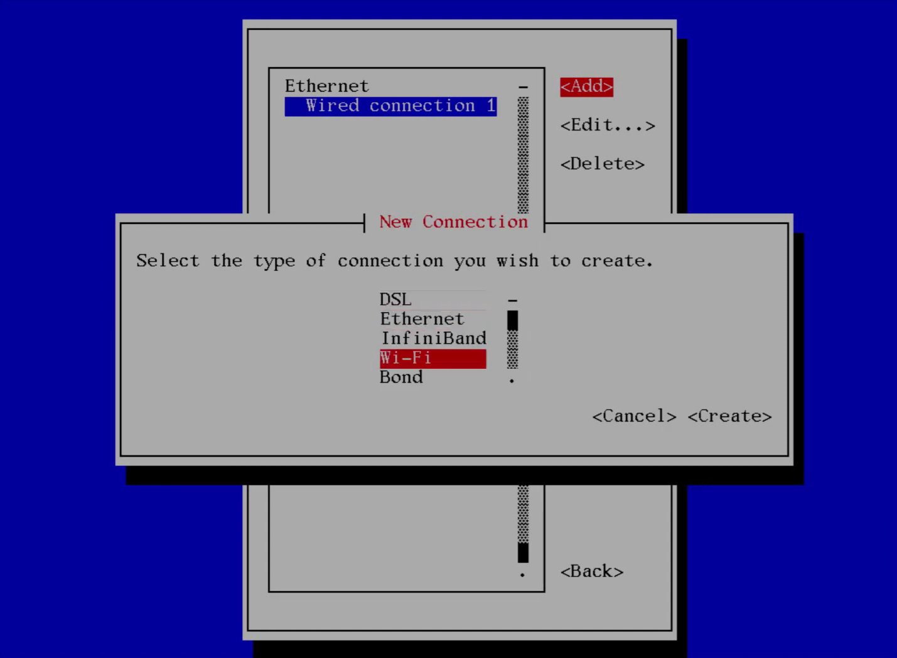

Choose a any name for you profile, but remember the Wifi device name you just checked with networkctl list.


Leave the text user interface, and type nmcli connection show, to check if your Wifi network is active, and ping google.com to finish the configuration.

---

## **4. Setting up hostname, time, locale & swap file**:

Simply edit the file with:

```shell
[root@archlinux ~]# vim /etc/hostname
```
```vim
archvirtualbox
~
~
~
```

Now, we'll edit the hosts file:

```shell
[root@archlinux ~]# vim /etc/hosts
```

```vim
# Static table lookup for hostnames.
# See hosts(5) for details.
127.0.0.1       localhost
::1             localhost
127.0.0.1       archvirtualbox.localdomain	  archvirtualbox
```
Save and exit with "Esc + :wq".

Next step is to set the proper timezone.

To check which timezone better suit you, you can use **timedatectl list-timezones** for the job, along side with **grep**.

```shell
[root@archlinux ~]# timedatectl list-timezones 
Africa/Abidjan
Africa/Accra
Africa/Algiers
Africa/Bissau
Africa/Cairo
Africa/Casablanca
Africa/Ceuta
Africa/El_Aaiun
Africa/Johannesburg
Africa/Juba
Africa/Khartoum
Africa/Lagos
Africa/Maputo
Africa/Monrovia
--MORE--
```

In my case, I used the Sao_Paulo time zone:

```shell
[root@archlinux ~]# timedatectl list-timezones | grep Sao_Paulo     
America/Sao_Paulo
```

Make a soft link between the timezone folder (/usr/share/zoneinfo/America/Sao_Paulo) and /etc/localtime.

```shell
[root@archlinux ~]# ln -sf /usr/share/zoneinfo/America/Sao_Paulo /etc/localtime
```

Syncronize the **hardware clock** with the **system clock** by using **hwclock**.


```shell
[root@archlinux ~]# hwclock --systohc
```

And enable network time protocol service, to syncronize our system clock with internet time services.

```shell
[root@archlinux ~]# timedatectl set-ntp true
```

So, lets check if everything is running smotly:

```shell
[root@archlinux ~]# timedatectl status
               Local time: Sat 2021-02-13 16:32:24 -03   
           Universal time: Sat 2021-02-13 19:32:24 UTC   
                 RTC time: Sat 2021-02-13 19:32:25       
                Time zone: America/Sao_Paulo (-03, -0300)
System clock synchronized: yes                           
              NTP service: active                        
          RTC in local TZ: no  
```

There we go! We can check our timezone, system clock syncronization and NTP service.

---

Now we will set up our **system locale**, to enable applications in our machine to correctly display **time**, **date** and **monitor regional values**.

Firstly, lets open with Vim the locale configuration file:

```shell
[root@archlinux ~]# vim /etc/locale.gen
```

Now, you just have to uncomment the one that you need. In my case, I want **en_US.UTF-8** and **pt_BR.UTF-8**. If you want to find some other locale using Vim just press "Esc + "/" + "text_to_search" + Enter".

Lets use **locale-gen** to generate the locales.

```shell
[root@archlinux ~]# locale-gen
Generating locales...
  en_US.UTF-8... done
  pt_BR.UTF-8... done
Generation complete.
```

Great, now we're going to create locale.conf file with this information:

```shell
[root@archlinux ~]# echo LANG=en_US.UTF-8 >> /etc/locale.conf
```

And also the keymap that we are using throughout this whole installation:

```shell
[root@archlinux ~]# echo KEYMAP=br-abnt2 >> /etc/vconsole.conf
```

---

### *Swap File*:

For creating our swap file, *cd* to the root directory (/) and create an empty file called swapfile

```shell
cd /
touch swapfile
```

Now, we will use the **dd**\* command, to inflate the file with zeros to the size that we want (where the **if** block is the input file and the **of** block is the path of the newly created swapfile).

\* since recent changes in the kernel we are using the **dd** command and not the **fallocate** command.

```shell
[root@archlinux /]# dd if=/dev/zero of=/swapfile bs=1M count=1000
1000+0 records in
1000+0 records out
1048576000 bytes (1.0 GB, 1000 MiB) copied, 0.97697 s, 1.1 GB/s
```

In this case, we are creating 1000 1M blocks, resulting in a swap of 1G.

Use the chmod to change the permission on the file (*600*, indicating that root user can only **read** and **write** but not **execute**, and **group** and **others** doesn't have any permission).

```shell
[root@archlinux /]# chmod 600 /swapfile
```

Check it by using the ls -lah command:

```shell
[root@archlinux /]# ls -alh
total 1001M
drwxr-xr-x  17 root root  4.0K Feb 13 16:51 .
drwxr-xr-x  17 root root  4.0K Feb 13 16:51 ..
lrwxrwxrwx   1 root root     7 Jan 18 22:32 bin -> usr/bin
drwxr-xr-x   4 root root  4.0K Feb 12 15:17 boot
drwxr-xr-x  18 root root  3.1K Feb 13 16:13 dev
drwxr-xr-x  39 root root  4.0K Feb 13 16:43 etc
drwxr-xr-x   3 root root  4.0K Feb 12 15:02 home
lrwxrwxrwx   1 root root     7 Jan 18 22:32 lib -> usr/lib
lrwxrwxrwx   1 root root     7 Jan 18 22:32 lib64 -> usr/lib
drwx------   2 root root   16K Feb 12 15:02 lost+found
drwxr-xr-x   2 root root  4.0K Jan 18 22:32 mnt
drwxr-xr-x   2 root root  4.0K Jan 18 22:32 opt
dr-xr-xr-x 131 root root     0 Feb 13 16:13 proc
drwxr-x---   4 root root  4.0K Feb 13 16:39 root
drwxr-xr-x  17 root root   440 Feb 13 16:17 run
lrwxrwxrwx   1 root root     7 Jan 18 22:32 sbin -> usr/bin
drwxr-xr-x   4 root root  4.0K Feb 12 15:09 srv
-rw-------   1 root root 1000M Feb 13 16:51 swapfile
dr-xr-xr-x  13 root root     0 Feb 13 16:12 sys
drwxrwxrwt   9 root root   180 Feb 13 16:32 tmp
drwxr-xr-x  10 root root  4.0K Feb 12 15:20 usr
drwxr-xr-x  12 root root  4.0K Feb 12 18:10 var
```

But this is just an empty file with the size of 1G of zeros. Now we need to convert it into an actual swap file, using **mkswap**.

```shell
[root@archlinux /]# mkswap swapfile 
Setting up swapspace version 1, size = 1000 MiB (1048571904 bytes)
no label, UUID=91895b3b-1f06-4bc0-bc61-c64f11491d73
```

Before we activate it, lets check our memory distribution:

```shell
[root@archlinux /]# free -m
              total        used        free      shared  buff/cache   available
Mem:           1977          68         781           0        1127        1757
Swap:             0           0           0
```

Now, lets imediatly activate the swap memory:

```shell
[root@archlinux /]# swapon /swapfile
```

And check it again:

```shell
[root@archlinux /]# free -m
              total        used        free      shared  buff/cache   available
Mem:           1977          68         779           0        1129        1757
Swap:           999           0         999
```

All good. But remember, these changes are not enabled to persist in our system. So, if we want the swapfile to be loaded automatically everytime our system starts, we will need to make an entry in our **fstab** file.

```shell
[root@archlinux /]# vim /etc/fstab
```

Insert the swapfile entry:
- \<file system\> = /swapfile
- \<dir\> = none
- \<type\> = swap
- \<options\> = sw
- \<dump\> = 0
- \<pass\> = 0

```vim
# Static information about the filesystems.
# See fstab(5) for details.

# <file system> <dir> <type> <options> <dump> <pass>
# /dev/sda2
UUID=26f0de7b-2541-48b6-a599-290acfff65fc	/         	ext4      	rw,relatime	0 1

# /dev/sda1
UUID=2A9C-03BC      	/boot/efi 	vfat      	rw,relatime,fmask=0022,dmask=0022,codepage=437,iocharset=ascii,shortname=mixed,utf8,errors=remount-ro	0 2

# /dev/sda3
UUID=bd284325-498c-42f2-ad52-2d19a1904ebb	/home     	ext4      	rw,relatime	0 2

/swapfile	none	swap	sw	0	0
```

Now reboot the system:

```shell
[root@archlinux /]# reboot
```

---

## **5. Setting up custom environment variables (.bashrc basic settings)**:

Lets make a few general environment modification that will affect every user.

Firstly, we will enable multilib on pacman.conf file, to be able to install 32 bit supported softwares (in my case, I'm doing this to install Steam).

Simply open **vim /etc/pacman.conf** and search for the following:

```vim
#[multilib]
#Include = /etc/pacman.d/mirrorlist
```

Now, uncomment both lines by removing the "#" and save the file by typing "Esc + :wq".

Update and refresh pacman:

```shell
[root@archvb /]# pacman -Syu
```

Now, as we did in the pacman mirrorlist at the beginning, we can use two methods for this:

### **METHOD 1**:

Firtly, let's edit .bashrc to configure our shell /bin/bash.

```shell
[root@archvb /]# cd /etc/skel
[root@archvb skel]# ls -la
total 20
drwxr-xr-x  2 root root 4096 Feb 12 15:09 .
drwxr-xr-x 39 root root 4096 Feb 13 17:08 ..
-rw-r--r--  1 root root   21 Dec 20 15:44 .bash_logout
-rw-r--r--  1 root root   57 Dec 20 15:44 .bash_profile
-rw-r--r--  1 root root  141 Dec 20 15:44 .bashrc
```

Such as adding the line **export EDITOR=vim" to make Vim your custom editor (or nano).

As **Top Linux Tech**, I'll also change a few things in my .bashrc configuration file, as such bellow:

```vim
#
# ~/.bashrc
#

# If not running interactively, don't do anything
[[ $- != *i* ]] && return

export EDITOR=vim

alias ls='ls --color=auto'
alias grep='grep --color=auto'
alias erep='erep --color=auto'
alias frep='frep --color=auto'

[ ! -e ~/.dircolors ] && eval $(dircolors -p > ~/.dircolors) 
[ -e /bin/dircolors ] && eval $(dircolors -b ~/.dircolors)

PS1='[\u@\h \W]\$ '
```

### **METHOD 2**:

If you want to tune up your bash, you may notice the **config.d** folder in this repository. In there, I copy two configuration files that should do the trick (I got those in this [article](https://wiki.archlinux.org/index.php/User:Grufo/Color_System%27s_Bash_Prompt) on the Arch Wiki.

First, check if **git** is alread insatlled, by typing *git --version*. Navigate to the temp folder and clone this repository:

```shell
[root@archvb ~]# cd /tmp && git clone https://github.com/sandesvitor/archlinux_tutorial_installation.git
```

**cd** into the cloned repository and copy both the **.bashrc** file to the /etc/skel, and the **DIR_COLORS** file to /etc/.

```shell
[root@archvb /tmp/archlinux_tutorial_installation]# cp ./config.d/.bashrc /etc/skel/ && cp ./config.d/DIR_COLORS /etc/
```
--- 

**cd** to */etc/skel* and copy every file in the /etc/skel to the home of the root user.

```shell
[root@archvb skel]# cp -a . ~
[root@archvb skel]# ls -al /root
total 44
drwxr-xr-x  4 root root 4096 Feb 13 17:19 .
drwxr-xr-x 17 root root 4096 Feb 13 16:51 ..
-rw-------  1 root root 1246 Feb 13 17:07 .bash_history
-rw-r--r--  1 root root   21 Dec 20 15:44 .bash_logout
-rw-r--r--  1 root root   57 Dec 20 15:44 .bash_profile
-rw-r--r--  1 root root  379 Feb 13 17:19 .bashrc
drwx------  3 root root 4096 Feb 13 16:16 .cache
drwx------  3 root root 4096 Feb 12 15:09 .gnupg
-rw-------  1 root root 8650 Feb 13 17:20 .viminfo
```

\* you will need to logout to see the changes.

## **6. Creating a standard user account**:

This will be the standart user account.

```shell
[root@archvb ~]# useradd --create-home sandesvitor
[root@archvb ~]# passwd sandesvitor
New password: 
Retype new password: 
passwd: password updated successfully
[root@archvb ~]# usermod -aG wheel,users,storage,power,lp,adm,optical sandesvitor
```

If you want to check the groups your user belong to:

```shell
[root@archvb ~]# id sandesvitor
uid=1000(sandesvitor) gid=1000(sandesvitor) groups=1000(sandesvitor),98(power),999(adm),998(wheel),991(lp),990(optical),988(storage),985(users)
```

Now, lets change the wheel group to enable every user belonging to it to use sudo freely (be wary of this power):

```shell
[root@archvb ~]# visudo
```

Uncomment the line "# %wheel ALL=(ALL) ALL" by removing the "#".


## **7. Installing Xorg, fonts, drivers & desktop environment**:

From the ArchLinux Wiki, *Xorg (commonly referred as simply X) is the most popular display server among Linux users. Its ubiquity has led to making it an ever-present requisite for GUI applications, resulting in massive adoption from most distributions*

We will install the xorg full package.

```shell
[root@archvb ~]# pacman -S xorg
```

After **xorg** installation, lets add some common font packages:

```shell
[root@archvb ~]# pacman -S ttf-dejavu ttf-droid ttf-hack ttf-font-awesome otf-font-awesome ttf-lato ttf-liberation ttf-linux-libertine ttf-opensans ttf-roboto ttf-ubuntu-font-family
```

### OPTIONAL!

Enabling a fine font rendering:

```shell
[root@archvb ~]# cd /etc/fonts/conf.d/
```

```shell
[root@archvb conf.d]# ln -s /etc/fonts/conf.avail/10-sub-pixel-rgb.conf /etc/fonts/conf.d/
[root@archvb conf.d]# ln -s /etc/fonts/conf.avail/11-lcdfilter-default.conf /etc/fonts/conf.d/
[root@archvb conf.d]# ln -s /etc/fonts/conf.avail/70-no-bitmaps.conf /etc/fonts/conf.d/
```
---

Enabling some free type fonts settings to be use in our user environment by default:

```shell
[root@archvb conf.d]# vim /etc/profile.d/freetype2.sh
```

Just uncomment the last line:


```vim
# Subpixel hinting mode can be chosen by setting the right TrueType interpreter
# version. The available settings are:
#
#     truetype:interpreter-version=35  # Classic mode (default in 2.6)
#     truetype:interpreter-version=38  # Infinality mode
#     truetype:interpreter-version=40  # Minimal mode (default in 2.7)
#
# There are more properties that can be set, separated by whitespace. Please
# refer to the FreeType documentation for details.

# Uncomment and configure below
export FREETYPE_PROPERTIES="truetype:interpreter-version=40"
```

---

### **INSTALLING VIDEO CARD DRIVER**:

To check what video graphics card you are using simply type:

```shell
[$] lspci | grep VGA                                               [17:58:31]
01:00.0 VGA compatible controller: NVIDIA Corporation GP107 [GeForce GTX 1050 Ti] (rev a1)
```

**Top Linux Tech** already compiled some packages for different vendors:

-------------------------------------------------------------------------------

1. INTEL

x86-video-intel libgl mesa **optionally**: vulkan-intel (for IvyBridge and newer generation of Intel CPU)

2. NVidia

nvidia nvidia-settings nvidia-utils mesa

3. AMD

mesa xf86-video-amdgpu vulkan-radeon

---------------------------------------------------------------------------------

If you're installing Arch on Virtualbox:
- virtualbox-guest-utils
- virtualbox-guest-dkms (if you are on LTS kernel older than 5.6)
- mesa
- mesa-libgl

*Ex:*
```shell
[root@archvb conf.d]# pacman -S nvidia nvidia-lts nvidia-settings nvidia-utils mesa
```

---

### **INSTALLING DESKTOP ENVIRONMENT (GNOME)**:

We will need:
- gnome;
- gnome-extra;
- gdm **or** lightdm.

```shell
[root@archvb conf.d]# pacman -S gnome gnome-extra lightdm lightdm-webkit2-greeter
```
Press Enter to every default option.

---

For the **desktop manager** you should have a lot of options, such as **KDE**, **GDM** or **LightDM**. As I prefer a more lighweight, extensible and good looking desktop, I chose the lightdm desktop manager. The **lightdm. 

If you choose **GDM**, just enable it and you are good to go:

```shell
[root@archvb conf.d]# systemctl enable gdm
```

But, if you choose **LightDM** follow the instructions bellow. 

Arch Wiki has a full article on LightDM (as it does on GDM): https://wiki.archlinux.org/index.php/LightDM. You should check it out for the installation.

For now, I'll use **lightdm-webkit2-greeter**, wich is a beatifull greeter with lots of configurations (in the article you'll be presented with a whole lot of options).

Keep in mind that you can change your desktop manager after the installation, but you'll have to be wary of changes in the service or boot options (such as removing the **/etc/systemd/system/default.target** and **systemctl set-default graphical.target**. Also, you'll need to disable your previous desktop manager and then enable your new one:

```shell
[root@archvb conf.d]# systemctl disable gdm
[root@archvb conf.d]# systemctl enable lightdm
```

With everything setup, let's enable lightdm to start on every boot:

```shell
[root@archvb conf.d]# systemctl enable lightdm.service --force
```

Now, let's update the /etc/lightdm/lightdm.conf to match our greeter and to guarantee that our graphics will be loaded correctly. 

Under the **[Seat:*]** section, search for exactly *greeter-session=* using Vim "Esc + /".

Uncomment by removing the "#" and make it such as *greeter-session=lightdm-webkit2-greeter*, or the name of the greeter you just installed.

Now, under the **[LightDM]** section, search for exactly *logind-check-graphical=*. Uncomment by removing the "#" and changing it to **true** (*logind-check-graphical=true*).

Save your changes and quit Vim "Esc + :wq".

In this whole process of downloading **gnome** it is possible that some packages fail to retrieve due to outdated package information. Simply refresh the database with "pacman -Syy".

\* like **apt update** every time you need to install new packages, it is recommended to refresh your database or rsync package information.

Install remaining updates and reboot the system:

```shell
[root@archvb conf.d]# pacman -Syu
```

Before rebooting your system, use Vim to open **/etc/pacman.conf**. Uncomment the "#Color" line, save and exit (Esc + :wq).

Now, reboot the system.

## **8. Customizing the Gnome desktop (gnome tweaks & shell extensions)**:

From here, if everything ran ok, you should be greeted by the Gnome GUI and Lightdm Webkit 2.

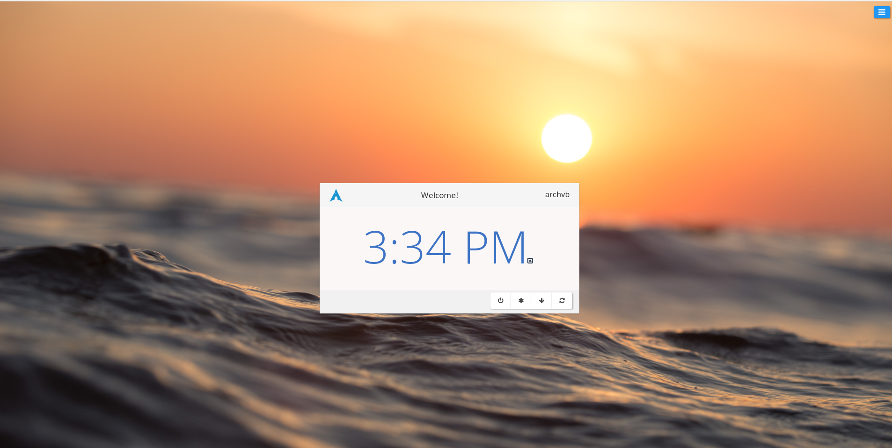

You should notice that I alread modify the background image, selecting an image from the right menu. Clicking the user, on the bottom left corner of the center box, you can choose the session (I choose Gnome Xorg).

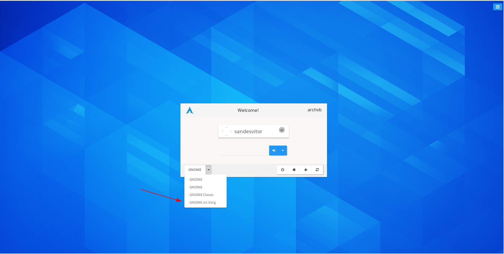

This is the most subjective part, and you should tweak around in Gnome to make the system that best suits you.

For now, you can just follow along to see how I configure my environmet.

Firstly, lets change the theme to a dark theme. Click the "Super Key" ("Windows Key") and type *tweaks* in the search bar.

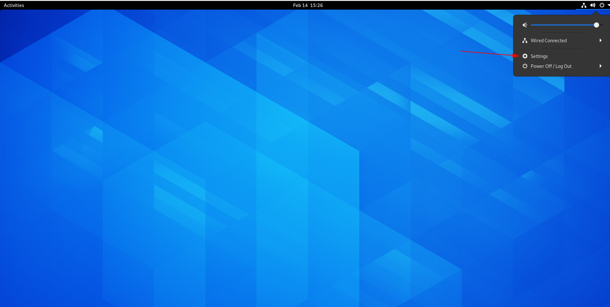

*NOTE:* If by any reason **gnome tweak** is not loading, try reinstalling it with pacman:

```shell
sandesvitor@archvb ~ $ sudo pacman -S gnome-tweak-tool
```

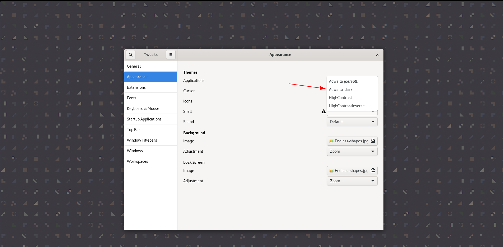

Now, go to **Activity** > **Settings**

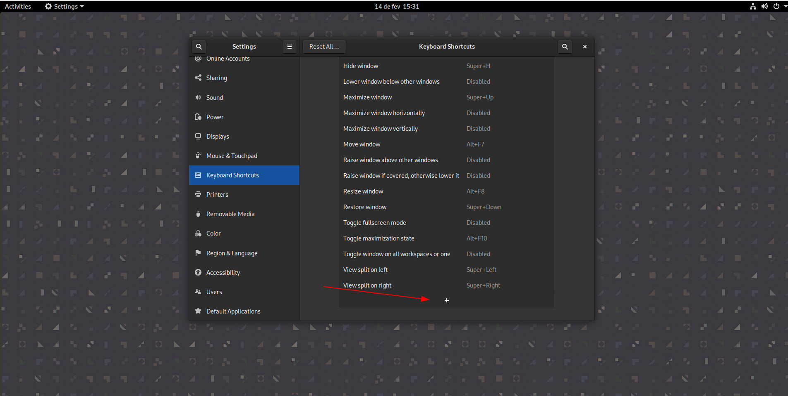

I like to create a shortcut to open a terminal, using the "Windows Key" or "Super" + "T".

Name your shortcut (in my case "Terminal Shortcut") and then type the command. 

Note that I use *--zoom=1.2* as an argument to *gnome-terminal*. This was a personal choice to make the terminal a bit bigger in my monitor.

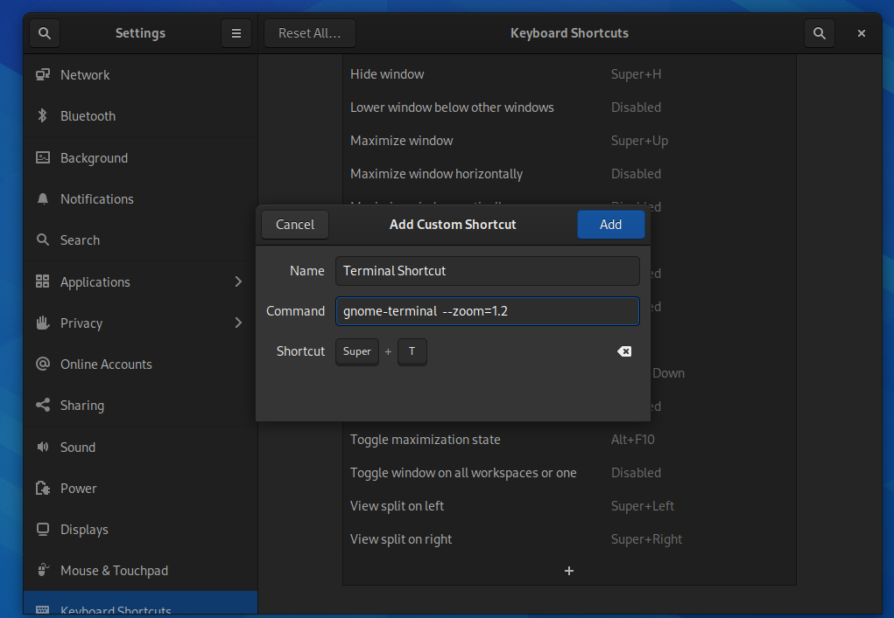

I removed English and added Protuguese (Brazil) to keyboard input, enabling my br-abnt2 keyboard.

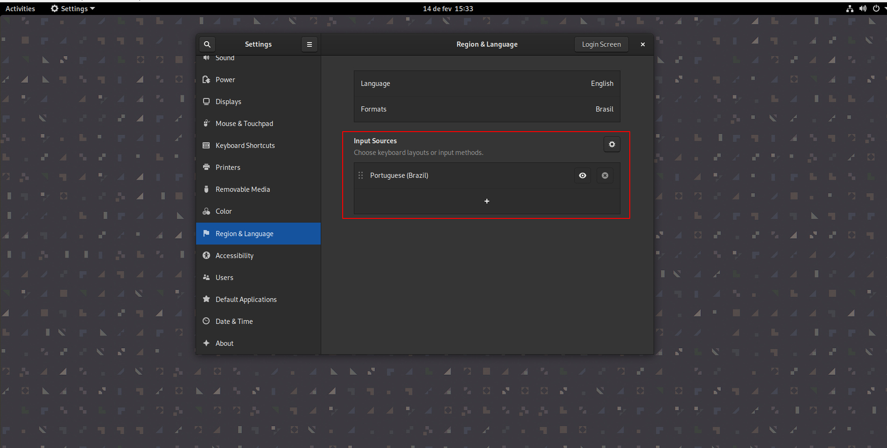

---

Now, open your terminal and lets install Firefox.

```shell
[sandesvitor@archvb ~]$ sudo pacman -Syy
[sandesvitor@archvb ~]$ sudo pacman -S firefox chrome-gnome-shell
```

Open Firefox and search for *gnome extensions*:


You'll have to install the browser extension before adding new extensions to your gnome.


After the installation, just search for any extension that you see fit. In my case, I'll download **OpenWeather** and **Just Perfection** (this extension was created by an youtuber called, you guessed it, **Just Perfection**).

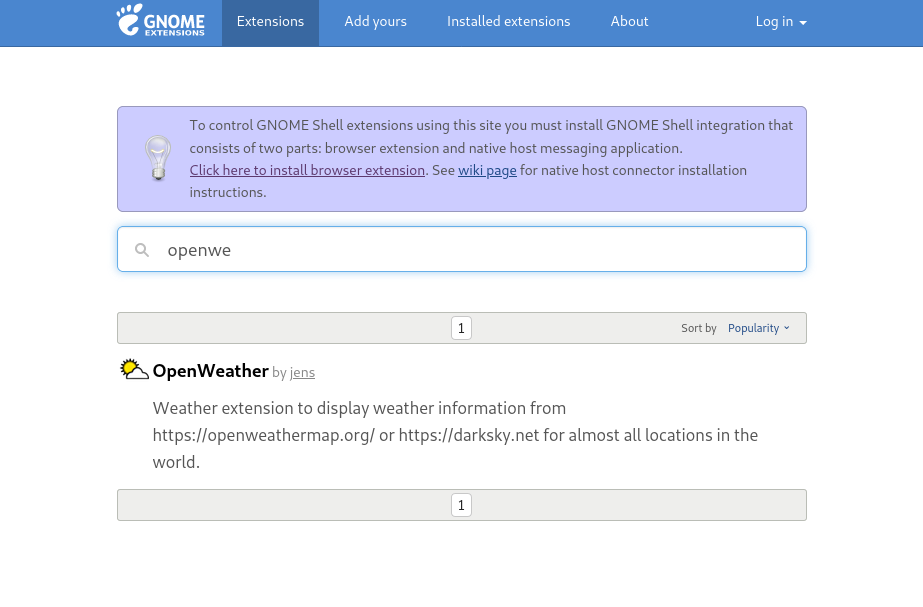

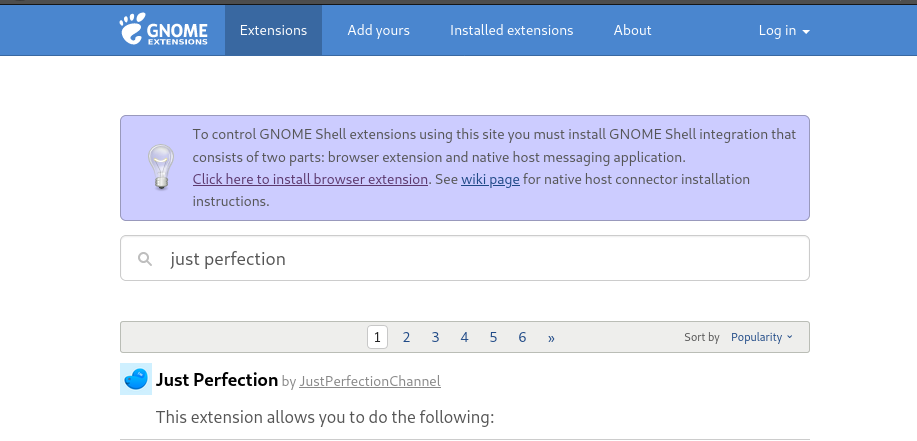

----

For my terminal, I updated my profile with the same color pallets as Pop-Os! default gnome-terminal.

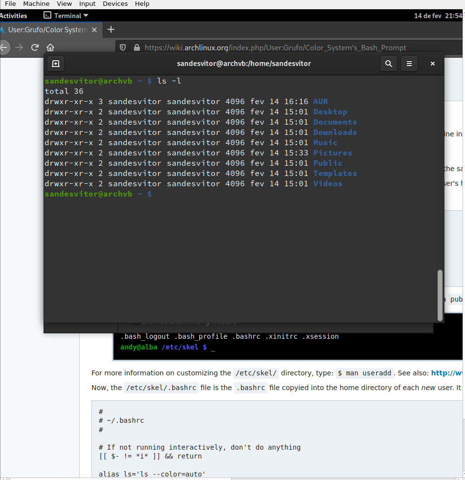

The color scheme is as follows:

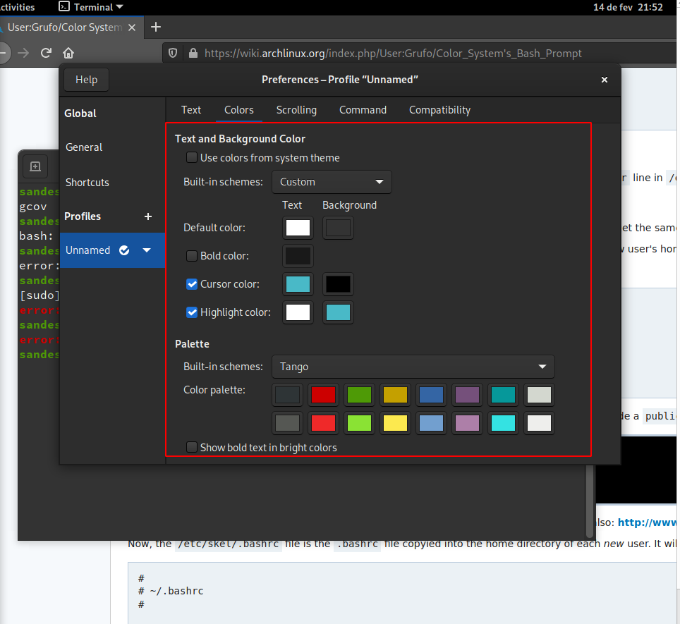

---

--------------- |      Text     |   Background  |
--------------- | ------------- | ------------- |
Default Color   |    FFFFFF     |    333333     |
Bold Color      |      -        |       -       |
Cursor Color    |    49B9C7     |    F6F6F6     |
Highlight Color |    FFFFFF     |    48B9C7     |


----

Ok, this is cool, but not glorious.

Since **LightDM** is awesome in its configurations, we can up our desktop game by adding another theme to our greeter.

Arch Linux has this thing called Arch User Repository (AUR) that permit us to download easily a bunch of softwares without going the usual *curl/wget* route, like Skype or Steam (check Arch Website for more details https://aur.archlinux.org/).

For now, we will use AUR to download **glorious theme** for lightdm-webkit2. 

Create a **AUR** folder in your user directory:

```shell
sandesvitor@archvb ~ $ mkdir AUR
sandesvitor@archvb ~ $ cd AUR
```

Check if git is downloaded by typing **git --version**. Now, type the following commands:

```shell
sandesvitor@archvb ~/AUR $ git clone https://aur.archlinux.org/lightdm-webkit2-theme-glorious.git
```

```shell
sandesvitor@archvb ~/AUR $ cd lightdm-webkit2-theme-glorious
```

```shell
makepkg -sri
```

After that, run Vim as sudo to edit lightdm-webkit2-greete.conf.

```shell
sandesvitor@archvb ~/AUR $ sudo vim /etc/lightdm/lightdm-webkit2-greeter.conf
```

Find *webkit_theme* then set its value to *glorious*.
Find *debug_mode* then set it to *true*.

And now...


Nice touch, right?

---

Another cool tool is **ulauncher** (https://ulauncher.io/), a really usefull and minimalist search bar that combines with Just Perfection extension. Since we alread use AUR to download glorious theme, this will be easy.

```shell
sandesvitor@archvb ~ $ cd AUR
```

```shell
sandesvitor@archvb ~/AUR $ git clone https://aur.archlinux.org/ulauncher.git && cd ulauncher && makepkg -is
```

The default shortcut for **ulauncher** is Ctrl + Space, but you can change that, along with it's themes, in the settings icon when ulauncher is opened.

Now, last but not least, since I love System 76 Pop-Os's! theme (as you might have notice by my gnoeme-terminal configuration), I'll leave a .png image of my favorite Pop-Os! backgraund image.


----

## References:

- https://www.youtube.com/watch?v=QMBE5Kxb8Bg (most of the process and tutorial);
- https://www.youtube.com/watch?v=_3-OMUQTf_k&t=392s

----
